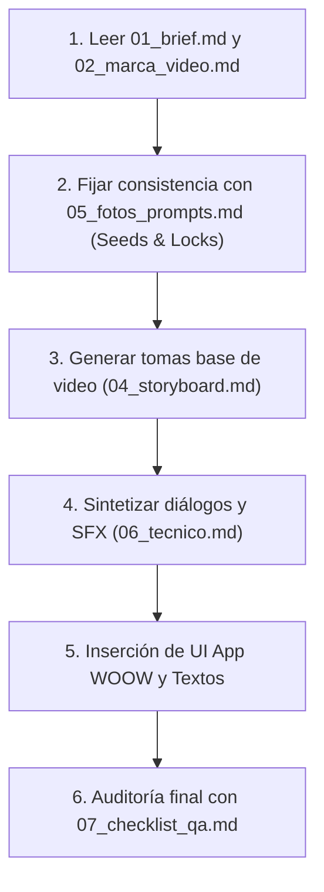

# 🎬 WOOW — Documentación Maestra de Producción Audiovisual con IA
## Miniserie Melodramática: "Sobreviviendo a Rogelio" (12 Episodios)

> **Versión:** 1.0 (Estandarizada para pipelines de IA: Flow / Runway Gen-3 / Kling / Midjourney / ElevenLabs)  
> **Marca:** WOOW (TODO BIEN WOOW, S.A.P.I. de C.V.)  
> **Proyecto:** Video Master de 3 min 50s (230s netos) seccionado en 12 micro-episodios de ~19s para TikTok, Reels y Shorts.

---

### 📌 Propósito de este Paquete Documental

Este repositorio contiene la arquitectura completa, técnica, visual y narrativa para que cualquier agente de inteligencia artificial o equipo de producción multimedia pueda generar, ensamblar y auditar la miniserie publicitaria de 12 micro-episodios de WOOW con **consistencia visual absoluta**, apego estricto a las directrices de marca y cadencia de retención para redes sociales.

---

### 📂 Estructura del Repositorio (Índice de Archivos)

| Archivo | Nombre del Documento | Descripción y Alcance |
| :--- | :--- | :--- |
| **`00_LEEME.md`** | **Índice y Flujo de Trabajo** | Este archivo. Visión general, mapa del proyecto y guía de navegación. |
| **`01_brief.md`** | **Brief Creativo y Estratégico** | Objetivos de negocio, target demográfico, justificación de datos WOOW, personajes y premisa. |
| **`02_marca_video.md`** | **Guía de Marca y Tono en Video** | Reglas editoriales WOOW, tono mexicano cotidiano, regla de oro (prohibición de *"bienestar"*), paleta e integración de la app. |
| **`03_no_hacer.md`** | **Reglas de Oro y Qué NO Hacer** | Prohibiciones estrictas: errores de prompts IA, vicios corporativos, venta dura y riesgos de consistencia. |
| **`04_storyboard.md`** | **Storyboard Narrativo (12 Capítulos)** | Desglose escena por escena de los 12 capítulos (~19s c/u): encuadres, acciones, diálogos, producto WOOW y cliffhangers. |
| **`05_fotos_prompts.md`** | **Hoja Maestra de Prompts de Video e Imagen** | *Prompt Locks* de consistencia de personajes (Alex, Sam, Rogelio el Dálmata), prompts en inglés para generación de video, seeds y negative prompts. |
| **`06_tecnico.md`** | **Especificaciones Técnicas de Producción** | Formato 9:16 (1080x1920), cadencia de corte, diseño de audio, SFX de telenovela, síntesis de voz (TTS) y capas UI de la app. |
| **`07_checklist_qa.md`** | **Checklist de Control de Calidad (QA)** | Matriz de validación previa a publicación: semáforo de marca, consistencia de personajes, sincronización y legibilidad. |

---

### 🚀 Flujo de Trabajo Recomendado para la IA Generadora

1. **Fase de Consistencia:** Antes de generar cualquier video, fijar los prompts maestros de Alex (mujer, 28 años), Sam (hombre, 38 años) y Rogelio (dálmata con arnés azul celeste).
2. **Fase de Generación de Clips:** Seguir la cadencia de 19 segundos por capítulo desglosada en `04_storyboard.md`.
3. **Fase de Audio y Doblaje:** Utilizar diálogos directos en español mexicano con inflexión de melodrama cómico.
4. **Fase de QA:** Ningún capítulo se aprueba si incumple las reglas de `03_no_hacer.md`.
