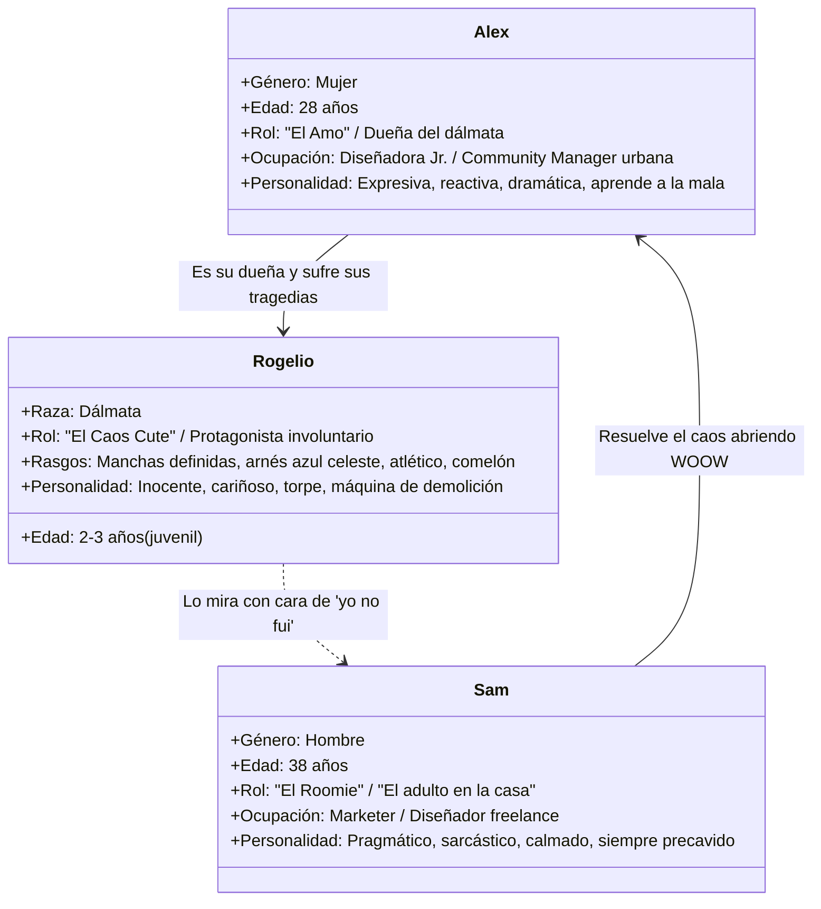

# 📄 01. Brief Creativo y Estratégico

## Proyecto: Miniserie Melodramática "Sobreviviendo a Rogelio"

---

### 1. Información General
* **Marca:** WOOW (TODO BIEN WOOW, S.A.P.I. de C.V.) — El primer marketplace digital de seguros y asistencias en México.
* **Formato:** Video Master vertical (9:16) de 3 minutos 50 segundos (230 segundos netos), estructurado en **12 micro-episodios independientes de ~19 segundos**.
* **Canales de Difusión:** TikTok, Instagram Reels, YouTube Shorts y Facebook Reels.
* **Tono / Género:** Melodrama cómico / Telenovela mexicana contemporánea. Diálogos cotidianos, situaciones reales exageradas, efectos de sonido dramáticos y remates en *freeze-frame*.

---

### 2. Objetivo de Negocio y Comunicación
* **Objetivo Principal:** Posicionar a WOOW como el marketplace integral donde resuelves cualquier siniestro o urgencia de la vida cotidiana desde el celular, de manera rápida, transparente y sin burocracia.
* **Objetivo de Retención:** Crear un bucle de consumo continuo (*binge-watching*) donde cada micro-episodio resuelva una catástrofe con un seguro de WOOW y corte en un *cliffhanger* que obligue al usuario a ver el siguiente capítulo.
* **Estrategia de Venta No Invasiva:** En ningún momento los personajes hacen venta dura ni leen un anuncio. La app de WOOW entra en escena como el salvavidas natural y espontáneo que apaga el fuego en segundos.

---

### 3. Audiencia Objetivo y Justificación con Datos Reales (WOOW 2026)

La historia está construida intencionalmente alrededor de las dos cohortes demográficas más activas en la adquisición de seguros digitales en WOOW:

1. **Cohorte Alex (25 a 34 años — 1.63% de penetración, 602 usuarios activos):**
   * Jóvenes profesionistas urbanos, nativos digitales, dueños primerizos de mascotas, independientes o viviendo con *roomies*. Tienden a contratar seguros después de haber vivido una mala experiencia previa (pantallas rotas, emergencias veterinarias imprevistas).
2. **Cohorte Sam (35 a 44 años — 1.67% de penetración, 615 usuarios activos — Cohorte más grande):**
   * Adultos consolidados, trabajadores independientes, pragmáticos. Entienden el valor del dinero y saben que prevenir cuesta una fracción de lo que cuesta una catástrofe. Son quienes impulsan la adopción de seguros multivertical (Hogar, Auto, Gastos Médicos).

---

### 4. Perfiles de Personajes

* **Alex (Mujer, 28 años):**
  * *Vestuario recurrente:* Pijama moderna / pants casuales en casa, ropa urbana juvenil en exteriores (jeans, sudadera).
  * *Arquetipo:* La protagonista de telenovela que siente que el universo conspira en su contra.
* **Sam (Hombre, 38 años):**
  * *Vestuario recurrente:* Playera azul marino/carbón, pantalones de descanso grises, café en mano, lentes de pasta casuales.
  * *Arquetipo:* La voz de la sensatez. No se estresa porque sabe que tiene la app de WOOW para resolverlo todo.
* **Rogelio (Dálmata macho, 2–3 años):**
  * *Rasgos físicos clave:* Dálmata blanco con motas negras simétricas en rostro y lomo, porte esbelto, orejas caídas expresivas, **arnés de tela color azul celeste**.
  * *Arquetipo:* El galán involuntario del melodrama. No tiene malicia; simplemente es un dálmata joven con exceso de energía.

---

### 5. Premisa y Ecosistema de Productos (1 Día, 12 Productos)
Toda la historia transcurre a lo largo de **24 horas continuas** ("el día catastrófico"). Un evento desata el siguiente en un efecto dominó ininterrumpido:

1. **Cap. 01:** Protección Celular *(Pantalla estrellada al despertar).*
2. **Cap. 02:** Seguro de Gadgets *(Esquina de laptop mordisqueada).*
3. **Cap. 03:** Accidentes Personales *(Resbalón con cáscara de mango en la cocina).*
4. **Cap. 04:** Seguro de Mascotas — Responsabilidad Civil *(Escape a la calle y salto a cofre de auto).*
5. **Cap. 05:** Seguro de Movilidad / Ciclistas *(Frenón y rin doblado en la ciclovía).*
6. **Cap. 06:** Seguro de Mascotas — Gastos Médicos Veterinarios *(Ingestión de chocolate en el parque).*
7. **Cap. 07:** Seguro de Auto — Asistencia Vial 24/7 *(Batería muerta y ponchadura saliendo del vet).*
8. **Cap. 08:** Seguro de Auto — Daños Interiores *(El cono veterinario empuja café caliente a la palanca).*
9. **Cap. 09:** Asistencias del Hogar — Cerrajería y Plomería *(Llaves en coladera + tubería rota).*
10. **Cap. 10:** Telemedicina y Orientación Médica 24/7 *(Agotamiento, compresa en frente y videoconsulta).*
11. **Cap. 11:** Ecosistema Marketplace WOOW *(Balance de gastos: $47,500 en juego vs $0 gastado).*
12. **Cap. 12:** Branding Master & Cierre Novela *(Freeze frame cómico, remate y jingle WOOW).*
